# 🔐 Hybrid Certificate Authentication & Verification System

<div align="center">

[](https://opensource.org/licenses/MIT)
[](https://www.python.org/downloads/)
[](https://polygon.technology/)
[](https://cryptography.io/)
[](https://en.wikipedia.org/wiki/Steganography)

**A tamper-proof, verifiable digital certificate system combining Blockchain, Cryptography, and Steganography to prevent forgery and ensure authenticity.**

<sub>Hackathon-ready demo • Clean architecture • Realistic flows</sub>

[🚀 Live Demo](https://your-demo-link.com) • [📖 Documentation](https://your-docs-link.com) • [🐛 Report Bug](https://github.com/Kush-Modi/Certificate-Auth/issues) • [✨ Request Feature](https://github.com/Kush-Modi/Certificate-Auth/issues)

</div>

---

## 📋 Table of Contents

- [🎯 Problem](#-problem)
- [🚀 Solution](#-solution)
- [🏗️ Architecture](#️-architecture)
- [🛠️ Tech Stack](#️-tech-stack)
- [🔄 How It Works](#-how-it-works)
- [🎮 Demo Instructions](#-demo-instructions)
- [🌱 Future Scope](#-future-scope)
- [🤝 Contributing](#-contributing)
- [📄 License](#-license)

---

## ⚡ Quick Demo (TL;DR)

```bash
# Backend (API)
cd backend
npm install
# Set your MUMBAI_RPC_URL and PRIVATE_KEY in backend/.env (see below)
npm run dev

# Frontend (Web)
cd ../frontend
npm install
npm start
# Open http://localhost:3000
```

---

## 🎯 Problem

<div align="center">

**Digital certificates are under attack** 🚨

</div>

Digital certificates in PDF/image format are **easily forged** or **altered**. Current verification methods suffer from critical vulnerabilities:

<table>
<tr>
<td width="50%">

### ❌ Current Issues
- **Vulnerable to tampering** - metadata can be modified
- **Centralized dependencies** - single points of failure  
- **No immutable record** - certificates can be duplicated
- **Easy to fake** - simple copy-paste of QR codes

</td>
<td width="50%">

### 🌍 Real-world Impact
- Fake academic degrees flooding job markets
- Counterfeit medical certificates endangering public health
- Forged professional licenses compromising safety standards
- Identity theft and credential fraud

</td>
</tr>
</table>

---

## 🚀 Solution

<div align="center">

**Our hybrid approach combines three powerful security layers** 🛡️

</div>

<table>
<tr>
<td width="33%">

### 🔗 Blockchain Layer
**Immutability & Transparency**

- Store certificate hashes on **Polygon/Ethereum testnet**
- **Immutable record** - once stored, cannot be altered
- **Public verification** - anyone can verify authenticity
- **Decentralized trust** - no single point of failure

</td>
<td width="33%">

### 🔐 Cryptography Layer
**Authenticity & Integrity**

- **Digital signatures** using RSA/ECC key pairs
- **Issuer authentication** - prevents impersonation
- **Data integrity** - detects any modifications
- **Public key verification** - cryptographically secure

</td>
<td width="33%">

### 🕵️ Steganography Layer
**Obfuscation & Anti-Theft**

- **Hidden embedding** of blockchain transaction ID and signature
- **Decoy data** to confuse attackers
- **Invisible to casual inspection** - data hidden in image/PDF
- **Anti-copy protection** - prevents simple metadata theft

</td>
</tr>
</table>

---

## 🏗️ Architecture

```mermaid
graph TB
    A[Certificate Upload] --> B[Generate Hash]
    B --> C[Create Digital Signature]
    C --> D[Store on Blockchain]
    D --> E[Embed via Steganography]
    E --> F[Secured Certificate]
    
    G[Verification Request] --> H[Extract Hidden Data]
    H --> I[Verify Blockchain Hash]
    I --> J[Check Digital Signature]
    J --> K{All Valid?}
    K -->|Yes| L[✅ Valid Certificate]
    K -->|No| M[❌ Invalid Certificate]
    
    style A fill:#e1f5fe
    style F fill:#c8e6c9
    style L fill:#c8e6c9
    style M fill:#ffcdd2
```

<div align="center">



</div>

---

## 🛠️ Tech Stack

<table>
<tr>
<td width="25%">

### 🐍 Backend
- **Python 3.8+** - Core logic
- **Flask/FastAPI** - Web framework
- **Web3.py** - Blockchain integration
- **Cryptography** - Digital signatures
- **Pillow** - Image processing
- **PyPDF2** - PDF manipulation

</td>
<td width="25%">

### ⛓️ Blockchain
- **Polygon Testnet** - Low-cost transactions
- **Ethereum** - Alternative option
- **MetaMask** - Wallet integration
- **IPFS** - Decentralized storage

</td>
<td width="25%">

### 🎨 Frontend
- **React.js** - Modern UI framework
- **Material-UI** - Professional design
- **QR Code Scanner** - Mobile verification
- **File Upload** - Drag & drop interface

</td>
<td width="25%">

### 🔒 Security
- **RSA 2048-bit** - Digital signatures
- **SHA-256** - Hashing algorithm
- **LSB Steganography** - Data hiding
- **AES Encryption** - Additional security

</td>
</tr>
</table>

---

## 🔄 How It Works

### 📝 Certificate Issuance Flow


### 🔍 Verification Process


---

## 🔎 How Verification Works

```mermaid
flowchart LR
  A[Uploaded Certificate File] --> B[Steganography Extraction]
  B -->|Extract hash + signature + txHash| C[Cryptography Verification]
  C -->|Verify RSA signature over hash| D[Blockchain Verification]
  D -->|Fetch tx by txHash and compare data/hash| E{All Valid?}
  E -->|Yes| F[✅ Certificate Valid]
  E -->|No| G[❌ Certificate Forged]
```



---

## 🧪 Testing Instructions

### Backend

```bash
# 1) Start backend
cd backend
npm install
npm run dev

# 2) Issue certificate
curl -X POST http://localhost:5000/api/issue/certificate \
  -F "certificate=@certificates/demo-certificate.pdf" \
  -F "issuerId=demo-issuer" \
  -F "issuerName=Demo University" \
  -F "recipientName=Alice" \
  -F "certificateType=Degree"

# Response contains: certificateHash, transactionHash, embeddedFilePath

# 3) Verify certificate by file
curl -X POST http://localhost:5000/api/verify/certificate \
  -F "certificate=@<path-to-embedded-file>"

# 4) Verify by hash
curl http://localhost:5000/api/verify/hash/<certificateHash>

# 5) Verify by transaction hash
curl http://localhost:5000/api/verify/transaction/<transactionHash>
```

### Frontend

```bash
cd frontend
npm install
npm start
# Open http://localhost:3000
# Issue a certificate, view txn hash, embedded hash, and download secured file.
# Then verify via the Verify page (Stego → Crypto → Blockchain).
```

---

## 🔧 Environment Setup (Blockchain)

Create `backend/.env` with:

```env
MUMBAI_RPC_URL=https://polygon-mumbai.infura.io/v3/<YOUR_KEY>
PRIVATE_KEY=0x<YOUR_PRIVATE_KEY>
# Optional
# SEPOLIA_RPC_URL=https://sepolia.infura.io/v3/<YOUR_KEY>
# MNEMONIC="word1 word2 ... word12"
```

If not provided, a simulated on-chain fallback is used for demos.

---

## 🛡️ Noise Defense (Steganography)

The steganography layer supports an optional Noise Defense mode:

```mermaid
flowchart LR
  A[Payload Builder] -->|Real entry| B((PNG LSB))
  A -->|Decoy entries (fake hashes/signatures)| B
  B --> C[Verifier]
  C -->|Extracts only real entry| D[Validates Signature + Chain]
```

- Real signed payload is embedded along with several decoys.
- Verifier detects and uses only the real entry; decoys are ignored.

Enable via Issue UI toggle: “Noise Defense Enabled”.

---

## ✅ Security Checklist

- Steganography: Hidden payload with optional decoys
- Cryptography: RSA digital signatures over file hash
- Blockchain: Combined hash (file + signature) anchored on-chain

All three must pass → certificate is valid.

---

## 🏛️ Multiple Authorities Supported (Simulation)

The system supports issuing by different authorities via a simple registry. Backend exposes `/api/registry` to list authorities and uses the selected authority's public key for verification.

Example:

```bash
# Issue with University A
curl -X POST http://localhost:5000/api/issue/certificate \
  -F "certificate=@certificates/demo-certificate.pdf" \
  -F "issuerId=demo" \
  -F "issuerName=Demo" \
  -F "issuerNameSelected=University A" \
  -F "recipientName=Alice" \
  -F "certificateType=Degree"

# Attempt to verify under Org B's key would fail signature check
```

Use the Issue UI dropdown to pick the authority.

## 🖼️ Demo Screenshots

- Issue Certificate Wizard (with Noise Defense)
- Verification Page showing Stego → Crypto → Blockchain badges

Add screenshots to `docs/` as you capture them.

## 🎮 Demo Instructions

### 🚀 Quick Start

```bash
# Clone the repository
git clone https://github.com/Kush-Modi/Certificate-Auth.git
cd Certificate-Auth

# Create virtual environment
python -m venv venv
source venv/bin/activate  # On Windows: venv\Scripts\activate

# Install dependencies
pip install -r requirements.txt

# Start the application
python app.py

# Open browser to http://localhost:5000
```

### 🎯 Demo Features

<table>
<tr>
<td width="50%">

#### 📤 Issuer Portal
- Upload certificate (PDF/Image)
- Generate digital signature
- Store hash on blockchain
- Download secured certificate
- View transaction details

</td>
<td width="50%">

#### 📥 Verifier Portal
- Upload certificate for verification
- System extracts hidden data
- Verifies blockchain hash
- Checks digital signature
- Shows verification result

</td>
</tr>
</table>

### 📋 Sample Certificates
- 🎓 Academic degree certificate
- 🏥 Medical prescription
- 💼 Professional license
- 🏆 Training completion certificate

---

## 🌱 Future Scope

### 🚀 Phase 2: Enhanced Security
- [ ] **Zero-knowledge proofs** for privacy-preserving verification
- [ ] **Multi-signature certificates** for collaborative issuing
- [ ] **AI-powered forgery detection** using machine learning
- [ ] **Biometric integration** for additional authentication

### 📈 Phase 3: Scalability
- [ ] **Multi-blockchain support** (Ethereum, Polygon, BSC)
- [ ] **Distributed issuer registry** (Decentralized PKI)
- [ ] **Mobile app** for on-the-go verification
- [ ] **API integration** for third-party systems

### 🔮 Phase 4: Advanced Features
- [ ] **Smart contracts** for automated verification
- [ ] **NFT-based certificates** for unique digital assets
- [ ] **Cross-chain verification** for global compatibility
- [ ] **Enterprise dashboard** for bulk certificate management

---

## 🤝 Contributing

We welcome contributions! Please see our [Contributing Guidelines](CONTRIBUTING.md) for details.

### 🛠️ Development Setup

```bash
# Install development dependencies
pip install -r requirements-dev.txt

# Run tests
pytest tests/

# Code formatting
black .
flake8 .
```

---

## 📄 License

This project is licensed under the MIT License - see the [LICENSE](LICENSE) file for details.

---

## 🏆 Hackathon Impact

<div align="center">

**This project demonstrates real-world problem solving with cutting-edge technology** 🏅

</div>

<table>
<tr>
<td width="50%">

### 🎯 Key Strengths
- **Real-world problem solving** - addresses certificate forgery
- **Technical innovation** - hybrid security approach
- **Scalable architecture** - blockchain + cryptography + steganography
- **User-friendly interface** - simple verification process
- **Future-ready** - expandable to multiple use cases

</td>
<td width="50%">

### 🏆 Perfect For Hackathons
- **Blockchain & Web3** - Decentralized verification
- **Cybersecurity** - Multi-layer security approach
- **Digital Identity** - Tamper-proof certificates
- **Supply Chain** - Verification systems
- **EdTech** - Academic credential verification

</td>
</tr>
</table>

---

## 📞 Contact

<div align="center">

**Kush Modi** | **Certificate Authentication System**

[](https://github.com/Kush-Modi)
[](https://www.linkedin.com/in/kush-modi-647b73372/)
[](mailto:kushmodi.0505@gmail.com)

</div>

---

## 👥 Contributors

- Kush Modi — GitHub: https://github.com/Kush-Modi — LinkedIn: https://www.linkedin.com/in/kush-modi-647b73372/

<div align="center">

**Built with ❤️ for a more secure digital world**

[](https://python.org)
[](https://ethereum.org)

</div>